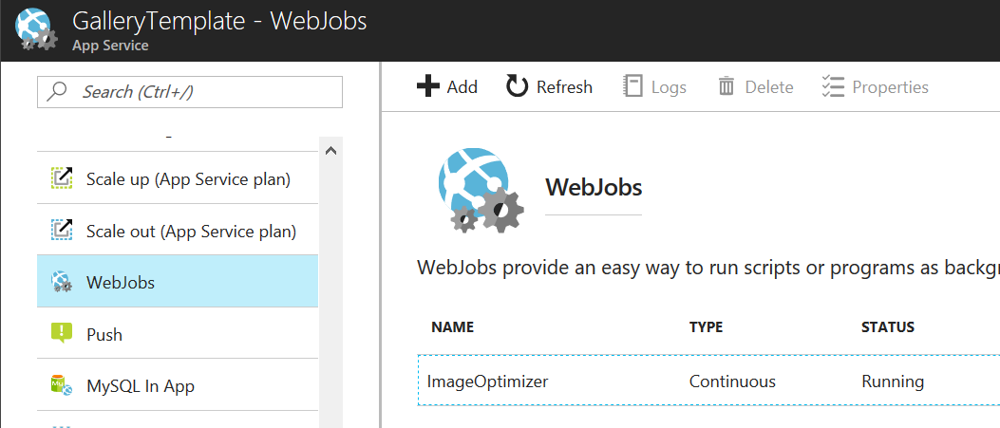
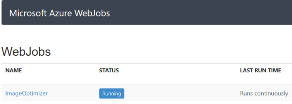
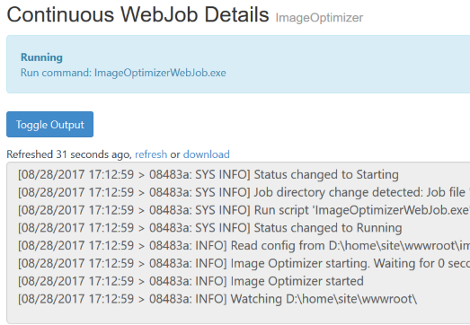
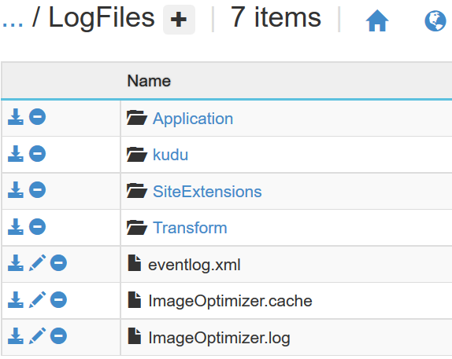
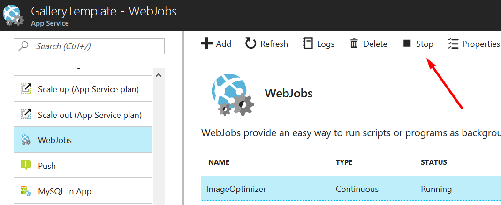

# Azure Image Optimizer

[](https://ci.appveyor.com/project/madskristensen/imageoptimizerwebjob)
[](https://nuget.org/packages/Azure.ImageOptimizer/)

An Azure App Services WebJob that compresses all images being uploaded or deployed to your website. It removes all unneeded bytes from the file to make it as small as possible - without quality loss. When the compression algorithms have finished running, the old image is replaced by the new optimized one.

Industry standard algorithms are being used to provide optimal compression. 

## Content

 - [Supported file types](#supported-file-types)
 - [Supported platforms](#supported-platforms)
 - [Install](#install)
   - [Verify install](#verify-install)
 - [Track progress](#track-progress)
 - [Reset Image Optimizer](#reset-image-optimizer)
 - [Configure](#configure)
 - [Lossy vs. lossless compression](#lossy-vs.lossless-compression)
- [Best practices](#best-practices)

## Supported file types

- JPG
- Gif
- PNG

## Supported platforms

- Azure App Services (formerly known as Azure Websites)
- ASP.NET
- ASP.NET Core

The Azure.ImageOptimizer will only run on Azure. Installing the NuGet package locally won't do anything until published to Azure.

## Install
In your ASP.NET or ASP.NET Core project, install the NuGet package [Azure.ImageOptimizer](https://www.nuget.org/packages/Azure.ImageOptimizer/).

**ASP.NET**

> nuget install-package Azure.ImageOptimizer

**ASP.NET Core**

> dotnet add package Azure.ImageOptimizer

When the NuGet package is installed into your web project, simply deploy the project to Azure like you normally do.

The NuGet package will automatically add an [Azure Webjob](https://docs.microsoft.com/en-us/azure/app-service-web/web-sites-create-web-jobs) to the deployed artifacts that is performing all of the image optimizations.

### Verify installation
Log in to the [Azure Portal](https://portal.azure.com/) and navigate to the website you just published. Select the **Webjobs** blade to make sure you see **ImageOptimizer** show up on the list like this:



Then head to the SCM dashboard for Azure Webjobs which is located here: 

https:// mywebsite.**scm**.azurewebsites.net/azurejobs/

> replace *mywebsite* with the name of your website.

You should see this:



Clicking on the **ImageOptimizer** link will take you to the details page where you can see the console output:



When you see this, it means that the ImageOptimizer is running correctly.

## Track progress
Go to the debug console located at:

https:// mywebsite.**scm**.azurewebsites.net/DebugConsole

...and click the **LogFiles** folder. You should then see something similar to this:



Notice the two files called **ImageOptimizer.Cache** and **ImageOptimizer.log**.

The **.cache** file is used by the optimizer engine to keep track on what files have been previously compressed, so that it doesn't run on files twice unless it has changed.

The **.log** file is the interesting one containing information about what files were optimized and by how much. 

## Reset Image Optimizer
To reset the ImageOptimizer Webjob, delete the **.cache** and **.log** files from the Azure Debug Console (see the [Track Progress section](#track-progress) for details).

Then restart the Webjob from the Azure Portal by clicking **Stop** and then **Start**.



## Configure
By default, ImageOptimizer will optimize all image files located at the root of your website or any subfolder hereof. 

This behavior can be customized so that only certain folders are included in the optimzation and even only a certain type of image files (like .png but not .gif).

Here's how to do that.

In the root of your web project, add a file with the name **imageoptimizer.json** and give it this content.

```json
{
  "optimizations": [
    {
      "includes": [ "img/**/*.*" ],
      "lossy": true
    }
  ]
}
```

The above JSON shows how to automatically compress all image files inside the **img/** folder and its sub folders.

ASP.NET Core projects uses a **wwwroot** folder, so make sure to include that folder in the `includes` element if you're using ASP.NET Core. It would then look like this:

```json
{
  "optimizations": [
    {
      "includes": [ "wwwroot/img/**/*.*" ],
      "lossy": true
    }
  ]
}
```

You can also **exclude** certain files (or globbing patterns) like this:


```json
{
  "optimizations": [
    {
      "includes": [ "img/**/*.*" ],
      "excludes": [ "**/*.jpg" ],
      "lossy": true
    }
  ]
}
```

In the above example we are including all files inside the *img/* directory, with the exception of an *.jpg* files.

Use multiple definitions together by adding more rules to the `optimizations` array.

```json
{
  "optimizations": [
    {
      "includes": [ "wwwroot/albums/*/thumbnail/*.*" ],
      "lossy": true
    },
    {
      "includes": [ "wwwroot/albums/*/*.*" ],
      "lossy": false
    }
  ]
}
```

This is how the [Photo Gallery](https://github.com/madskristensen/PhotoGallery/) web app is configured. It will perform **lossy** compression on images located in *wwwroot/albums/\*/thumbnail/* folder and **lossless** compression to any files above the */thumbnail/* sub folder.

## Lossy vs. lossless compression
**Lossless compression** is the process of removing reducing the file size of the image without any quality degredation. In other words, using lossless compression is completely safe to use because it doesn't reduce the quality of the image.

Lossless compression usually yields between **5% and 20%** recuction of file size.

**Lossy compression** is differernt from lossless in that it does reduce the quality of the image it compresses. However, the algorithms being used are so sophisticated that the quality loss may not be visible to the human eye.

The benefit of using lossy compression is that it reduces the file size significantly more than lossless compression.

Lossy compression yields file reductions of up to **70%** of the original size.

## Best practices
Here are some best practices for image optimization

### Compress in advance
All images that are part of your project can be optimized in advance before deploying to Azure. Use any good compression tool such as the [Image Optimizer extension](https://marketplace.visualstudio.com/items?itemName=MadsKristensen.ImageOptimizer) for Visual Studio (they both run the exact same algorithms).

### Compress only user uploaded images
When everything is compressed in advance (see above trick), you only need to run the ImageOptimizer on the folders that contain images that didn't exist in advance - also knows as user generated/uploaded images. 

Make sure to [configure](#configure) accordingly.

### Limit what to compress
When you [configure](#configure) the ImageOptimizer, make sure you don't include the entire website but only includes the folder paths/globbing where the image files are. You'll use fewer resources and avoid unneeded optimizations.